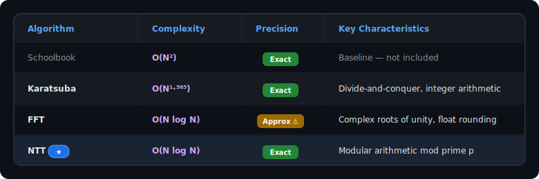
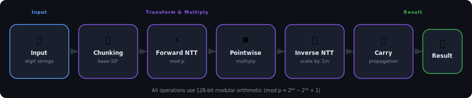
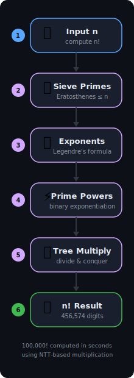

<!-- <p align="center">
  
</p> -->

<h1 align="center">⚡ Fast Multiplication Playground</h1>

<p align="center">
  <b>High-performance arbitrary-precision multiplication algorithms implemented in C</b>
</p>

<p align="center">
  
  
  
</p>

<p align="center">
  <a href="#-overview">Overview</a> •
  <a href="#-key-features">Features</a> •
  <a href="#-how-it-works">How It Works</a> •
  <a href="#%EF%B8%8F-getting-started">Getting Started</a> •
  <a href="#-performance-highlights">Performance</a> •
  <a href="#-contributing">Contributing</a>
</p>

---

## 📖 Overview

A collection of fast multiplication algorithms designed for **arbitrary-precision integer arithmetic** — numbers with hundreds of thousands (or even millions) of digits. The project explores the performance landscape from classical divide-and-conquer methods to advanced transform-based approaches, culminating in the computation of **100,000!** (a number with **456,574 digits**) in seconds.

<!-- DEMO GIF: Place a terminal recording here showing 100000! being computed -->
<!-- <p align="center">
  
</p> -->

---

## ✨ Key Features

| Feature | Description |
|---|---|
| 🔢 **Arbitrary Precision** | Multiply numbers with millions of digits — far beyond what native types support |
| ⚡ **NTT Multiplication** | $O(N \log N)$ using the Number Theoretic Transform with exact integer arithmetic |
| 🌊 **FFT Multiplication** | $O(N \log N)$ using the Fast Fourier Transform with complex roots of unity |
| 🧮 **Karatsuba Multiplication** | $O(N^{1.585})$ divide-and-conquer — faster than textbook $O(N^2)$ for large inputs |
| 🏭 **Fast Factorial** | Computes $n!$ via prime factorization + divide-and-conquer multiplication |
| 🧵 **Multithreading Support** | Thread pool and pthread utilities (work in progress) |
| 🔍 **NTT Prime Finder** | Python script to discover primes of the form $p = k \cdot 2^m + 1$ with small primitive roots |

---

## 📊 Algorithm Comparison

<!-- <p align="center">
  
</p> -->

<!-- SCREENSHOT: Place a performance comparison chart/screenshot here -->
<!-- <p align="center">
  
</p> -->

---

## 🏗️ Project Structure

<details>
<summary><b>📂 Click to expand full directory tree</b></summary>
<br/>

```text
fast-mult-playground/
│
├── fft/                        # Fast Fourier Transform
│   ├── fft_v1.c                    # Recursive FFT with complex roots of unity
│   └── fft_v2.c                    # Improved FFT variant
│
├── ntt/                        # Number Theoretic Transform
│   ├── ntt_v1.c                    # Initial NTT implementation
│   ├── ntt_v2.c                    # Optimized coefficient handling
│   ├── ntt_v3.c                    # Refactored transforms
│   ├── ntt_v4.c                    # 128-bit modular arithmetic
│   └── ntt_v5.c                    # ★ Latest — fast-base chunking + factorial
│
├── karatsuba/                  # Karatsuba Algorithm
│   ├── karatsuba_v1.c              # Initial Karatsuba implementation
│   └── karatsuba_v0.c              # ★ Optimized with in-place scratch buffers
│
├── threading/                  # Multithreading Utilities
│   ├── thread_pool.c               # Thread pool implementation
│   ├── thread_trial.c              # Threading experiments
│   └── pthread_cheatsheet.pdf      # pthreads reference (LaTeX source included)
│
├── utils/                      # Shared Data Structures
│   ├── utils.h                     # C Library macros, ANSI debuggers, and truncators
│   ├── utils.c                     # Custom charArray memory structs and helpers
│   └── Queue.h                     # Queue implementation
│
├── scripts/                    # Helper Scripts
│   ├── prime_generator.py          # NTT-friendly prime finder (Miller-Rabin)
│   └── test_algorithms.py          # Automated arbitrary-precision validation suite
│
└── data/                       # Output & Configuration
    ├── factorial_result.txt        # Precomputed 100000! result (456,574 digits)
    └── PRIMES_Groots.txt           # Discovered NTT primes with primitive roots
```

</details>

---

## 🧠 How It Works

### NTT Multiplication Pipeline

The Number Theoretic Transform is the crown jewel of this project. Here's the full pipeline:

<p align="center">
  
</p>

1. **Chunking** — Digits are grouped into base-$10^k$ "super-digits" for efficiency
2. **Forward NTT** — Evaluate the polynomial at $n$-th roots of unity modulo a prime $p$
3. **Pointwise Multiplication** — Multiply evaluations element-wise in $O(N)$
4. **Inverse NTT** — Recover the product polynomial's coefficients
5. **Carry Propagation** — Convert back to human-readable decimal digits

> [!IMPORTANT]
> **Why NTT over FFT?**
> Both achieve $O(N \log N)$, but NTT operates entirely with **integer modular arithmetic** (modulo $p = 2^{64} - 2^{32} + 1$), eliminating the floating-point rounding errors that plague FFT. This ensures **exact** results for arbitrarily large numbers.

### Fast Factorial via Prime Factorization

Computing $n!$ naively requires $n-1$ sequential multiplications. Instead, this project uses a **prime-power factorization** approach:

<p align="center">
  
</p>

<details>
<summary><b>🔎 Step-by-step breakdown</b></summary>
<br/>

1. **Sieve primes** up to $n$ using the Sieve of Eratosthenes
2. **Compute exponents** of each prime $p$ in $n!$ using Legendre's formula: $\sum_{i=1}^{\infty} \lfloor n / p^i \rfloor$
3. **Raise each prime** to its exponent using binary exponentiation + NTT multiplication
4. **Multiply all prime powers** together using a balanced divide-and-conquer tree

This approach is dramatically faster because it minimizes the number of large-number multiplications and keeps intermediate results balanced in size.

</details>

---

## 🛠️ Getting Started

### Prerequisites

| Requirement | Details |
|---|---|
| **C Compiler** | GCC or Clang with C99+ support |
| **Math Library** | `-lm` (standard on most systems) |
| **pthreads** | Built-in on Linux/macOS; via [MinGW-w64](https://www.mingw-w64.org/) on Windows |
| **Python 3** | For running the prime generator scripts (optional) |

### Build & Run

### Build & Run

Using the provided `Makefile` is the recommended way to securely build and link all algorithms:

```bash
make clean
make all
```

This statically links the math and internal `utils.c` libraries, compiling them natively into their respective binaries (e.g., `./ntt/ntt_v5.exe`, `./fft/fft_v2.exe`) directly optimized with `-O3` flags. > [!NOTE]
> Ensure <kbd>make</kbd> and <kbd>gcc</kbd> are installed and integrated into your system's path.

### Command-Line Usage

All programs accept command-line arguments for specifying inputs and toggling debug output.

**Multiplication:**

```bash
./program <num1> <num2>         # multiply two numbers
./program <num1> <num2> -d      # multiply with debug output
```

**Exponentiation** (where supported):

```bash
./program -p <base> <exponent>       # compute base^exponent
./program -p <base> <exponent> -d    # with debug output
```

**Factorial:**

```bash
./program -f <N>         # compute N!
./program -f <N> -d      # with debug output
```

**Testing Mode:**

To validate your implementations against Python natively:
```bash
python scripts/test_algorithms.py
```

Running with **no arguments** uses built-in default values.

### Feature Support

| Program | Multiply | Power (`-p`) | Factorial (`-f`) | Debug (`-d`, `-d1`, `-d2`) |
|:---|:---:|:---:|:---:|:---:|
| `fft/fft_v1.c` | ✅ | ✅ | — | ✅ |
| `fft/fft_v2.c` | ✅ | ✅ | — | ✅ |
| `ntt/ntt_v1.c` | ✅ | ✅ | ✅ | ✅ |
| `ntt/ntt_v2.c` | ✅ | ✅ | ✅ | ✅ |
| `ntt/ntt_v3.c` | ✅ | ✅ | ✅ | ✅ |
| `ntt/ntt_v4.c` | ✅ | ✅ | ✅ | ✅ |
| `ntt/ntt_v5.c` | ✅ | ✅ | ✅ | ✅ |
| `karatsuba/karatsuba_v1.c` | ✅ | ✅ | — | ✅ |
| `karatsuba/karatsuba_v0.c` | ✅ | — | ✅ | ✅ |


### Finding NTT Primes

Use the included Python script to discover primes suitable for NTT:

```bash
python scripts/prime_generator.py
```

This searches for primes of the form $p = k \cdot 2^m + 1$ with small primitive roots — essential for NTT to work with specific transform sizes.

---

## 🚀 Performance Highlights

The NTT v5 implementation can compute **100,000!** (a 456,574-digit number) in a matter of seconds on consumer hardware.

<!-- SCREENSHOT: Place terminal output screenshots showing timing benchmarks here -->
<!-- <p align="center">
  
</p> -->

<!-- VIDEO: Place a demo video/GIF of the program running here -->
<!-- <p align="center">
  
</p> -->

---

## 📈 Evolution of Implementations

The NTT module went through **5 iterations** of optimization:

<details>
<summary><b>📜 Click to expand version history</b></summary>
<br/>

| Version | Key Improvement |
|:---:|:---|
| **v1** | Initial NTT with basic modular arithmetic |
| **v2** | Optimized coefficient extraction & handling |
| **v3** | Refactored forward/inverse transforms |
| **v4** | 128-bit intermediate products (`__uint128_t`) to prevent overflow |
| **v5** | Fast-base chunking (base-$10^k$) + optimized factorial with pre-allocated scratch space |

> [!TIP]
> Start with **NTT v5** — it contains all cumulative improvements and is the fastest implementation.

</details>

---

## 🤝 Contributing

Contributions are welcome! Potential areas for improvement:

- [ ] Complete multithreading integration for parallel NTT butterfly stages
- [ ] Implement the [Schönhage–Strassen algorithm](https://en.wikipedia.org/wiki/Sch%C3%B6nhage%E2%80%93Strassen_algorithm)
- [ ] Add [Toom-Cook (Toom-3)](https://en.wikipedia.org/wiki/Toom%E2%80%93Cook_multiplication) multiplication
- [ ] Benchmark and comparison harness across all algorithms
- [ ] SIMD optimizations for the NTT butterfly operations

Feel free to fork, experiment, and submit a pull request!

---

## 📜 License

This project is open-source and available for educational and recreational programming. No formal license has been specified yet.  
Explore, learn, and compute faster!

---

<p align="center">
  <i>Built with ❤️ for number theory</i>
</p>
