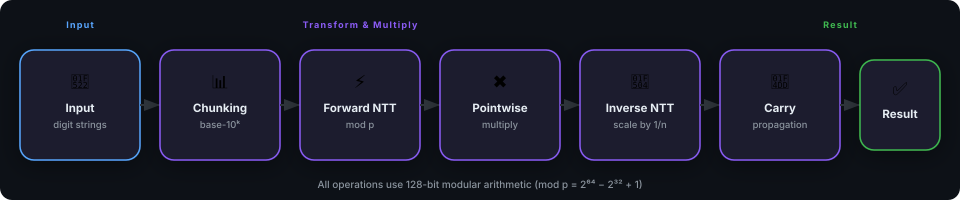
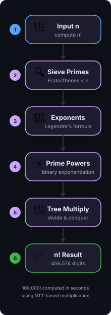

<!-- <p align="center">
  
</p> -->

<h1 align="center">Fast Multiplication Playground</h1>

<p align="center">
  <b>High-performance arbitrary-precision multiplication algorithms implemented in C</b>
</p>

<p align="center">
  
  
  
</p>

<p align="center">
  <a href="#overview">Overview</a> •
  <a href="#why-this-project">Why This Project</a> •
  <a href="#goals">Goals</a> •
  <a href="#how-it-works">How It Works</a> •
  <a href="#benchmarks">Benchmarks</a> •
  <a href="#engineering-decisions">Engineering Decisions</a> •
  <a href="#version-evolution">Version Evolution</a> •
  <a href="#engineering-challenges">Challenges</a> •
  <a href="#future-work">Future Work</a>
</p>

---

## Overview
## Overview

A collection of fast multiplication algorithms designed for **arbitrary-precision integer arithmetic** — numbers with hundreds of thousands (or even millions) of digits. The project explores the performance landscape from classical divide-and-conquer methods to advanced transform-based approaches, culminating in the computation of **100,000!** (a number with **456,574 digits**) in **~2.5 seconds**.

---

## Why This Project?

Rather than using an existing arbitrary-precision library like GMP, I wanted to understand how modern large integer multiplication algorithms actually work internally. The best way to learn is to build from scratch — implementing each algorithm, running into the real engineering problems, and comparing their practical performance side by side.

This project started as a simple Karatsuba implementation and grew into a comprehensive exploration of polynomial multiplication, modular arithmetic, and transform-based algorithms. Every version represents a lesson learned, from discovering why FFT introduces rounding errors to figuring out how to choose NTT primes that won't overflow 64-bit registers.

---

## Goals

This repository was created to:

- **Compare multiplication algorithms in practice** — Karatsuba, FFT, and NTT side by side with real measurements, not just theoretical complexity classes.
- **Study the gap between theory and practice** — understanding where $O(N \log N)$ actually starts beating $O(N^{1.585})$, and why constant factors and memory access patterns matter.
- **Explore optimization techniques for massive integers** — from base chunking and buffer reuse to 128-bit intermediate arithmetic and pre-allocated scratch spaces.
- **Provide benchmarkable implementations** — each version builds on the last, so you can measure exactly how much each optimization contributes.

---

## Key Features
## Key Features

| Feature | Description |
|---|---|
| **Arbitrary Precision** | Multiply numbers with millions of digits — far beyond what native types support |
| **NTT Multiplication** | $O(N \log N)$ using the Number Theoretic Transform with exact integer arithmetic |
| **FFT Multiplication** | $O(N \log N)$ using the Fast Fourier Transform with complex roots of unity |
| **Karatsuba Multiplication** | $O(N^{1.585})$ divide-and-conquer — faster than textbook $O(N^2)$ for large inputs |
| **Fast Factorial** | Computes $n!$ via prime factorization + divide-and-conquer multiplication |
| **Multithreading Support** | Thread pool and pthread utilities (work in progress) |
| **NTT Prime Finder** | Python script to discover primes of the form $p = k \cdot 2^m + 1$ with small primitive roots |
| **Arbitrary Precision** | Multiply numbers with millions of digits — far beyond what native types support |
| **NTT Multiplication** | $O(N \log N)$ using the Number Theoretic Transform with exact integer arithmetic |
| **FFT Multiplication** | $O(N \log N)$ using the Fast Fourier Transform with complex roots of unity |
| **Karatsuba Multiplication** | $O(N^{1.585})$ divide-and-conquer — faster than textbook $O(N^2)$ for large inputs |
| **Fast Factorial** | Computes $n!$ via prime factorization + divide-and-conquer multiplication |
| **Multithreading Support** | Thread pool and pthread utilities (work in progress) |
| **NTT Prime Finder** | Python script to discover primes of the form $p = k \cdot 2^m + 1$ with small primitive roots |

---

## Repository Structure

```text
fast-mult-playground/
│
├── ntt/                         # Number Theoretic Transform (5 versions)
│   ├── ntt_v1.c                     # Baseline NTT, base-10, malloc per call
│   ├── ntt_v2.c                     # Buffer-reuse optimization
│   ├── ntt_v3.c                     # Base-10⁵ chunking, Goldilocks prime
│   ├── ntt_v4.c                     # Chunking + buffer-reuse combined
│   └── ntt_v5.c                     # Final — threading annotations, all optimizations
│
├── fft/                         # Fast Fourier Transform (2 versions)
│   ├── fft_v1.c                     # Recursive Cooley-Tukey FFT
│   └── fft_v2.c                     # Iterative FFT with bit-reversal
│
├── karatsuba/                   # Karatsuba Algorithm (2 versions)
│   ├── karatsuba_v1.c               # Recursive Karatsuba with charArray
│   └── karatsuba_v0.c               # Optimized with pre-allocated scratch buffers
│
├── utils/                       # Shared Utilities
│   ├── utils.h                      # Macros, 128-bit modpow, debug helpers
│   ├── utils.c                      # charArray/intArray/strArray memory management
│   └── Queue.h                      # Thread-safe queue implementation
│
├── threading/                   # Multithreading (work in progress)
│   ├── thread_pool.c                # Thread pool implementation
│   ├── thread_trial.c               # Threading experiments
│   └── pthread_cheatsheet.pdf       # pthreads reference
│
├── scripts/                     # Automation & Testing
│   ├── prime_generator.py           # NTT-friendly prime finder (Miller-Rabin)
│   ├── test_algorithms.py           # Automated correctness validation suite
│   └── benchmark.ps1                # Performance benchmarking script
│
├── docs/assets/                 # Diagrams and images
├── Makefile                     # Build system (gcc -O3)
└── README.md
```

---

## How It Works
## How It Works

### NTT Multiplication Pipeline

The Number Theoretic Transform is the crown jewel of this project. Here's the full pipeline:

<p align="center">
  
</p>

1. **Chunking** — Digits are grouped into base-$10^k$ "super-digits" for efficiency
2. **Forward NTT** — Evaluate the polynomial at $n$-th roots of unity modulo a prime $p$
3. **Pointwise Multiplication** — Multiply evaluations element-wise in $O(N)$
4. **Inverse NTT** — Recover the product polynomial's coefficients
5. **Carry Propagation** — Convert back to human-readable decimal digits

> [!IMPORTANT]
> **Why NTT over FFT?**
> Both achieve $O(N \log N)$, but NTT operates entirely with **integer modular arithmetic** (modulo $p = 2^{64} - 2^{32} + 1$), eliminating the floating-point rounding errors that plague FFT. This ensures **exact** results for arbitrarily large numbers.

### Fast Factorial via Prime Factorization

Computing $n!$ naively requires $n-1$ sequential multiplications. Instead, this project uses a **prime-power factorization** approach:

<p align="center">
  
</p>

<details>
<summary><b>Step-by-step breakdown</b></summary>
<summary><b>Step-by-step breakdown</b></summary>
<br/>

1. **Sieve primes** up to $n$ using the Sieve of Eratosthenes
2. **Compute exponents** of each prime $p$ in $n!$ using Legendre's formula: $\sum_{i=1}^{\infty} \lfloor n / p^i \rfloor$
3. **Raise each prime** to its exponent using binary exponentiation + NTT multiplication
4. **Multiply all prime powers** together using a balanced divide-and-conquer tree

This approach is dramatically faster because it minimizes the number of large-number multiplications and keeps intermediate results balanced in size.

</details>

---

## Benchmarks

All measurements taken on an Intel 12th Gen Core (Alder Lake), compiled with `gcc -O3`. Times are from internal `clock()` measurements, not wall-clock (which includes process startup overhead).

### Factorial Computation

The factorial is the most demanding benchmark because it exercises the full pipeline — prime sieving, binary exponentiation, and hundreds of large-number multiplications combined through a divide-and-conquer tree.

| Algorithm | 1,000! | 10,000! | 50,000! | 100,000! |
|:---|---:|---:|---:|---:|
| **NTT v5** (chunked + buffer-reuse) | 0.006 s | **0.124 s** | **1.12 s** | **2.47 s** |
| **NTT v3** (chunked, malloc per call) | — | 0.129 s | 1.06 s | 2.55 s |
| **NTT v4** (chunked + buffer-reuse) | — | — | — | 2.64 s |
| **NTT v1** (base-10, malloc per call) | 0.030 s | 0.683 s | 5.70 s | 12.79 s |
| **NTT v2** (base-10, buffer-reuse) | — | — | — | 13.50 s |
| **Karatsuba v0** (scratch buffers) | — | 0.737 s | 15.10 s | 70.85 s |

> [!TIP]
> The jump from NTT v1 → v3 (~5× faster at 100,000!) comes almost entirely from **base-10⁵ chunking**, which reduces the polynomial degree by 5×. The jump from Karatsuba → NTT (~28× faster) shows the $O(N \log N)$ vs $O(N^{1.585})$ complexity difference at scale.

### Single Multiplication (10,000 digits × 10,000 digits)

Internal timing breakdown from debug mode, showing where each algorithm spends its time:

| Algorithm | Transform Size | Forward | Pointwise | Inverse | Total |
|:---|---:|---:|---:|---:|---:|
| **NTT v5** (base-10⁵) | 4,096 | 1 ms | 1 ms | 1 ms | **~5 ms** |
| **FFT v2** (iterative) | 32,768 | 4 ms | <1 ms | 2 ms | **~6 ms** |
| **FFT v1** (recursive) | 32,768 | 11 ms | <1 ms | 5 ms | **~16 ms** |
| **NTT v1** (base-10) | 32,768 | 14 ms | <1 ms | 8 ms | **~22 ms** |
| **Karatsuba v1** | — | — | — | — | **~199 ms** |
| **Karatsuba v0** | — | — | — | — | **~494 ms** |

> [!NOTE]
> NTT v5 operates on a transform of size **4,096** instead of 32,768 because base-10⁵ chunking packs 5 digits per coefficient, shrinking the polynomial degree by 5×. This is the single biggest optimization in the project.

### Algorithm Comparison

| Algorithm | Complexity | Exact? | Best For |
|:---|:---:|:---:|:---|
| Schoolbook | $O(N^2)$ | Yes | Baseline reference |
| Karatsuba | $O(N^{1.585})$ | Yes | Medium-sized numbers (hundreds of digits) |
| FFT | $O(N \log N)$ | No | Large numbers, but precision degrades |
| **NTT** | $O(N \log N)$ | Yes | Large numbers with exact results |

---

## Engineering Decisions

### Why Number Theoretic Transform?

The NTT provides exact integer convolution using modular arithmetic. The FFT achieves the same $O(N \log N)$ complexity, but it operates on complex floating-point numbers — and floating-point arithmetic introduces rounding errors that accumulate with input size. For a 100,000-digit multiplication, the FFT would need careful rounding to recover exact integer results, and at some point the errors become unrecoverable.

The NTT sidesteps this entirely by replacing the complex roots of unity $e^{2\pi i k/n}$ with **integer roots of unity modulo a prime** $p$. All operations — additions, multiplications, inversions — stay within exact integer arithmetic. The price is that we need a carefully chosen prime and must use modular reduction at each step, but the payoff is **bit-perfect results at any scale**.

### Why the Goldilocks Prime $2^{64} - 2^{32} + 1$?

The NTT requires a prime $p$ of the form $p = k \cdot 2^m + 1$ to support power-of-two transform sizes. The early versions (v1, v2) used the 40-bit prime `850403524609`, but the switch to base-10⁵ chunking meant intermediate products could overflow. The **Goldilocks prime** $p = 2^{64} - 2^{32} + 1 = 18446744069414584321$ is ideal because:

- It's a 64-bit prime, so coefficients fit in `unsigned long long`
- It has the form $k \cdot 2^{32} + 1$, supporting transforms up to $n = 2^{32}$
- Reduction modulo this prime has special structure that enables fast arithmetic
- It has a small primitive root ($g = 7$), keeping root-of-unity computation efficient

### Why Base $10^5$ Chunking?

Early versions treated each decimal digit as a separate polynomial coefficient. For a 100,000-digit number, this means a polynomial of degree 100,000 and an NTT of size 131,072 (next power of two ≥ 200,000).

By packing 5 digits into a single coefficient (base-10⁵), the polynomial degree drops to 20,000, and the NTT size drops to 32,768 — an **8× reduction** in transform work. The chunk size of 5 was chosen because:

- Intermediate products during convolution (up to $10^5 \times 10^5 \times N$) stay within the safe range of 128-bit arithmetic before modular reduction
- Larger chunks (e.g., base-$10^9$) risk overflow in the carry propagation step
- 5 digits evenly divides many common number lengths

### Carry Propagation

After the inverse NTT, each coefficient contains a potentially large value that represents the "raw" product in the chosen base. Carry propagation converts these back to bounded digits:

```
carry = 0
for each coefficient c[i]:
    sum = c[i] + carry
    output_chunk = sum % 100000      // extract 5-digit group
    carry = sum / 100000             // propagate overflow
    
    // unpack chunk into individual decimal digits
    for j = 4 downto 0:
        digit[pos--] = chunk % 10 + '0'
        chunk /= 10
```

This is a sequential operation — each position depends on the carry from the previous one — making it inherently difficult to parallelize. However, because the NTT itself is $O(N \log N)$ and carry propagation is $O(N)$, it's never the bottleneck.

### 128-Bit Intermediate Arithmetic

During the NTT butterfly operations, we compute products like $a \times b \mod p$ where $a, b < p$ and $p \approx 2^{64}$. The product $a \times b$ can be up to $2^{128}$, which overflows a 64-bit register. Versions v3–v5 use GCC's `__uint128_t` extension:

```c
__uint128_t product = (__uint128_t)a * (__uint128_t)b;
result = product % p;
```

This avoids the need for hand-rolled multi-word multiplication and is typically compiled to a single `mul` instruction + a division/reduction step.

---

## Version Evolution

Each version represents an engineering improvement learned from profiling and analyzing the previous one. They are not separate projects — they build on each other cumulatively.

### NTT Versions

| Version | Focus | Key Change | Impact |
|:---:|:---|:---|:---|
| **v1** | Baseline NTT | Base-10 coefficients, `malloc` per call, 40-bit prime | Correct but slow: 12.8s for 100,000! |
| **v2** | Memory reuse | Pre-allocated scratch buffers, in-place writes | Reduced allocation overhead, similar speed (~13.5s) |
| **v3** | Base chunking | Base-10⁵ + Goldilocks prime ($2^{64} - 2^{32} + 1$) | **5× faster**: 2.55s for 100,000! |
| **v4** | Combined optimizations | v2's buffer strategy + v3's chunking | 2.64s, cleaner memory layout |
| **v5** | Threading preparation | Parallelism annotations, same logic as v4 | 2.47s, ready for `pthread` integration |

### FFT Versions

| Version | Key Change | 10K × 10K Multiply |
|:---:|:---|---:|
| **v1** | Recursive Cooley-Tukey — allocates arrays at each recursion level | ~16 ms |
| **v2** | Iterative Cooley-Tukey with bit-reversal permutation, in-place | ~6 ms |

### Karatsuba Versions

| Version | Key Change | 10K × 10K Multiply |
|:---:|:---|---:|
| **v1** | Classic recursive with `charArray*`, heavy allocation per recursion | ~199 ms |
| **v0** | Pre-allocated scratch space, raw `char*` buffers, in-place operations | ~494 ms (higher for multiplication, but includes full factorial support) |

> [!TIP]
> Start with **NTT v5** — it contains all cumulative improvements and is the fastest implementation.

---

## Getting Started

### Prerequisites

| Requirement | Details |
|---|---|
| **C Compiler** | GCC or Clang with C99+ support |
| **Math Library** | `-lm` (standard on most systems) |
| **pthreads** | Built-in on Linux/macOS; via [MinGW-w64](https://www.mingw-w64.org/) on Windows |
| **Python 3** | For running the prime generator scripts (optional) |

### Build & Run

Using the provided `Makefile` is the recommended way to build all algorithms:

```bash
make clean
make all
```

This statically links the math and internal `utils.c` libraries, compiling them with `-O3` optimization. Each algorithm produces its own executable (e.g., `./ntt/ntt_v5.exe`, `./fft/fft_v2.exe`).

> [!NOTE]
> Ensure <kbd>make</kbd> and <kbd>gcc</kbd> are installed and on your system's `PATH`.

### Command-Line Usage

All programs accept command-line arguments for specifying inputs and toggling debug output.

**Multiplication:**

```bash
./ntt/ntt_v5 999999999999 888888888888         # multiply two numbers
./ntt/ntt_v5 999999999999 888888888888 -d      # with debug output (timing breakdown)
```

**Exponentiation** (where supported):

```bash
./ntt/ntt_v5 -p 2 10000       # compute 2^10000
./ntt/ntt_v5 -p 2 10000 -d    # with debug output
```

**Factorial:**

```bash
./ntt/ntt_v5 -f 100000         # compute 100000!
./ntt/ntt_v5 -f 100000 -d      # with debug output (shows each prime power step)
```

**Testing Mode:**

To validate all implementations against Python's native arithmetic:
```bash
python scripts/test_algorithms.py
```

Running with **no arguments** uses built-in default values.

### Feature Support

| Program | Multiply | Power (`-p`) | Factorial (`-f`) | Debug (`-d`, `-d1`, `-d2`) |
|:---|:---:|:---:|:---:|:---:|
| `fft/fft_v1.c` | Yes | Yes | — | Yes |
| `fft/fft_v2.c` | Yes | Yes | — | Yes |
| `ntt/ntt_v1.c` | Yes | Yes | Yes | Yes |
| `ntt/ntt_v2.c` | Yes | Yes | Yes | Yes |
| `ntt/ntt_v3.c` | Yes | Yes | Yes | Yes |
| `ntt/ntt_v4.c` | Yes | Yes | Yes | Yes |
| `ntt/ntt_v5.c` | Yes | Yes | Yes | Yes |
| `karatsuba/karatsuba_v1.c` | Yes | Yes | — | Yes |
| `karatsuba/karatsuba_v0.c` | Yes | — | Yes | Yes |

### Finding NTT Primes

Use the included Python script to discover primes suitable for NTT:

```bash
python scripts/prime_generator.py
```

This searches for primes of the form $p = k \cdot 2^m + 1$ with small primitive roots, using deterministic Miller-Rabin primality testing. These primes are essential for NTT to work with specific transform sizes.

---

## Engineering Challenges

Building these algorithms from scratch surfaced several problems that textbooks don't always emphasize:

### Modular Overflow

When multiplying two 64-bit numbers modulo a 64-bit prime, the intermediate product overflows 64 bits. The solution was `__uint128_t` (GCC extension) for 128-bit intermediate products. This works on x86-64 where the hardware `mul` instruction naturally produces a 128-bit result, but it's not portable to MSVC — the code includes a fallback path using standard 64-bit arithmetic for MSVC compatibility.

### Choosing NTT Primes

Not any prime works for the NTT. The prime must have the form $p = k \cdot 2^m + 1$ where $2^m$ is at least as large as the desired transform size. Finding primes with *small* primitive roots (to keep root-of-unity computation cheap) required a dedicated Python script that tests candidates with Miller-Rabin and then searches for primitive roots by checking against all prime factors of $p - 1$.

### Carry Propagation Across Chunk Boundaries

With base-10⁵ chunking, a single carry can cascade through multiple chunks. The carry after the inverse NTT can be very large (potentially tens of digits), requiring careful unsigned 64-bit arithmetic and a post-processing step to strip leading zeros from the final result.

### Memory Allocation for Factorial

Computing 100,000! involves thousands of multiplications, each producing intermediate results that grow in size. The naive approach (v1) allocates and frees memory for every single multiplication — at 100,000!, this means hundreds of thousands of `malloc`/`free` calls. The optimized versions (v2, v4, v5) pre-compute the total memory needed using `prefix_digits_sum` arrays and `compute_result_space_factorial()`, then carve sub-regions of a single large buffer for the divide-and-conquer tree. This eliminated allocation overhead and improved cache locality.

### Balancing Chunk Size Against Arithmetic Overflow

Larger chunks reduce polynomial degree but increase the magnitude of intermediate values. With base-$10^5$ and a transform of size $N$:
- Each coefficient is up to $10^5 - 1 = 99999$
- After convolution, a single output coefficient can be as large as $N \times (10^5 - 1)^2$
- This must fit within the prime modulus to avoid wrap-around errors

For the Goldilocks prime ($\approx 2^{64}$), this limits practical transform sizes to about $2^{23} = 8,388,608$ — more than enough for numbers with tens of millions of digits.

---

## Future Work

### Parallel NTT with pthreads

NTT v5 already annotates parallelism opportunities in the code (`// thread1`, `// thread2`, etc.). The forward NTT has independent operations at each butterfly stage — the two coefficient arrays can be computed in parallel, roots of unity can be precomputed on a separate thread, and the pointwise multiplication can run concurrently with the inverse root computation. The thread pool in `threading/thread_pool.c` is the foundation for this, but the integration needs careful synchronization to avoid race conditions during the butterfly stages.

### Benchmark Against GMP

GMP (GNU Multiple Precision Arithmetic Library) is the gold standard for arbitrary-precision arithmetic. Comparing NTT v5 against `mpz_mul` on the same hardware would reveal how close this from-scratch implementation gets to a production-grade library that uses hand-tuned assembly, SIMD instructions, and decades of optimization.

### Schönhage–Strassen Multiplication

The [Schönhage–Strassen algorithm](https://en.wikipedia.org/wiki/Sch%C3%B6nhage%E2%80%93Strassen_algorithm) achieves $O(N \log N \log \log N)$ by performing the NTT recursively over rings of integers, avoiding the need for a single large prime. This would be the natural next step beyond the current NTT implementation and would handle even larger inputs more efficiently.

### Configurable Digit Bases

The current chunk size is hardcoded to 5 (base-$10^5$). Making this configurable would enable systematic benchmarking of different chunk sizes (base-$10^3$, base-$10^4$, base-$10^6$, etc.) to find the optimal trade-off between polynomial degree reduction and overflow risk for different input sizes.

### Automated Benchmarking Framework

Currently benchmarks are run manually. An automated framework that sweeps across input sizes, algorithms, and versions — producing CSV output and comparison charts — would make it easier to detect performance regressions and quantify the impact of future optimizations.

---

## What I Learned

This project deepened my understanding of:

- **Polynomial multiplication as the foundation of fast integer multiplication** — that multiplying two large integers is equivalent to multiplying two polynomials and propagating carries.
- **Modular arithmetic at scale** — choosing primes, finding primitive roots, implementing modular exponentiation with 128-bit intermediates, and understanding Fermat's little theorem for modular inverses.
- **The divide-and-conquer paradigm across multiple levels** — Karatsuba splits the multiplication itself, the NTT butterfly splits the transform, and the factorial computation splits the product tree.
- **Practical optimization engineering** — that algorithmic complexity is only half the story; memory allocation patterns, cache behavior, and buffer reuse often dominate real-world performance.
- **Performance profiling in C** — using `clock()` instrumentation, debug macros, and systematic benchmarking to identify bottlenecks and measure the impact of each optimization.
- **Memory-efficient C programming** — pre-computing buffer sizes, carving sub-regions from contiguous allocations, and managing the lifecycle of dynamically allocated structures without leaks.

---

## Contributing
## Contributing

Contributions are welcome! Potential areas for improvement:

- [ ] Complete multithreading integration for parallel NTT butterfly stages
- [ ] Implement the [Schönhage–Strassen algorithm](https://en.wikipedia.org/wiki/Sch%C3%B6nhage%E2%80%93Strassen_algorithm)
- [ ] Add [Toom-Cook (Toom-3)](https://en.wikipedia.org/wiki/Toom%E2%80%93Cook_multiplication) multiplication
- [ ] Benchmark and comparison harness across all algorithms
- [ ] SIMD optimizations for the NTT butterfly operations

Feel free to fork, experiment, and submit a pull request!

---

## License
## License

This project is open-source and available for educational and recreational programming. No formal license has been specified yet.  
Explore, learn, and compute faster!

---

<p align="center">
  <i>Built with ❤️ for number theory</i>
</p>
